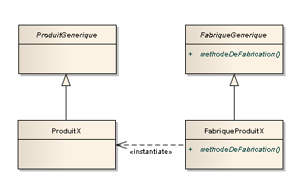

# Le design pattern Factory

Le design pattern Factory, ou **Fabrique** est un design pattern permettant de séparer la création d'objets dérivant d'une classe mère de leur utilisation.

Voici le diagramme UML du design pattern Factory :

Comme vous pouvez voir ci-dessus, afin de créer notre **Fabrique**, nous avons besoin de 4 éléments : 
1. Une fabrique générique : Elle contient toutes les méthodes nécessaires à la création d'un produit
2. Une fabrique : Elle va créer le produit souhaité
3. Un produit : Le produit créé par la fabrique, dérivant du produit générique
4. Un produit générique : Le produit d'origine, contenant toutes les méthodes permettant de réaliser les actions associées

Ainsi, nous détachons la création (instanciation) des objets de l'utilisation, ce qui permet d'éviter une certaine redondance au niveau de la programmation.

Nous pouvons voir aussi que le fait de passer par des classes filles pour créer différents objets permet de répondre au principe OCP, qui, rappelons le, consiste à dire d'un object qu'il doit être **ouvert aux extensions** et **fermé aux modifications**.

Pour être plus clair dans la présentation de ce design pattern, nous allons vous présenter un exemple.
