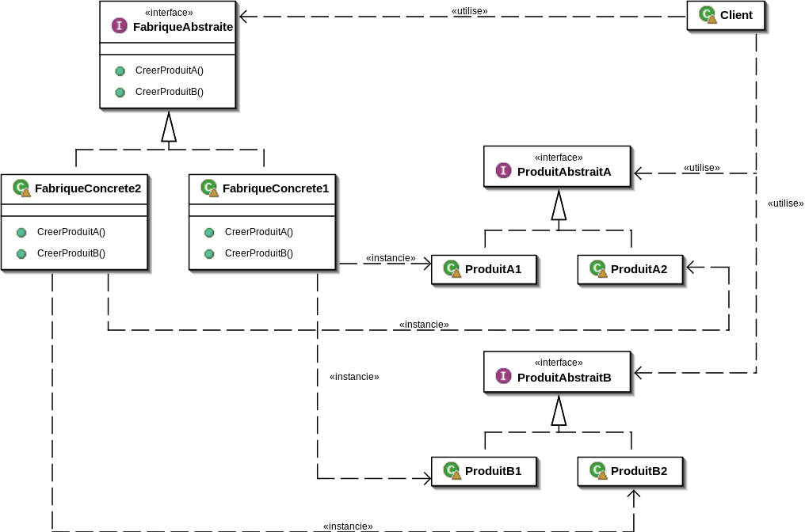

# Design pattern Abstract Factory

Le design pattern Abstract Factory, ou **Fabrique abstraite** reprend le même principe que **Factory**, à l'exception que nous considérons dans ce cas un ensemble de fabrique. En effet, la **Fabrique abstraite** permet non pas d'instancier différents objets d'une même classe mère mais plusieurs objets de plusieurs classes mères.

Voici le diagramme UML du design pattern Abstract Factory :

D'après ce diagramme, nous pouvons repérer les différents éléments suivants :
1. FabriqueAbstraite : la fabrique abstraite contenant toutes les méthodes de création d'objets, le client peut seulement intéragir avec.
2. FabriqueConcrete1 & FabriqueConcrete2 : Les fabriques dérivant de la fabrique abstraite, permettant d'instancier les objets souhaités.
3. ProduitAbstraitA & ProduitAbstraitB : Les classes abstraites des objets, elles contiennent les méthodes d'utilisation propre à chaque objet.
4. ProduitA1/B1 & ProduitA2/B2 : Les classes dérivant des produits abstraits, ce sont ces produits qui seront renvoyés au client.

De la même manière que le design pattern Factory, nous détachons toutes méthodes de création des méthodes d'utilisation, afin de faciliter la maintenance et la compréhension des applications.

Nous allons à présent vous présenter un exemple plus concret afin d'être plus clair sur l'utilisation de ce design pattern.
